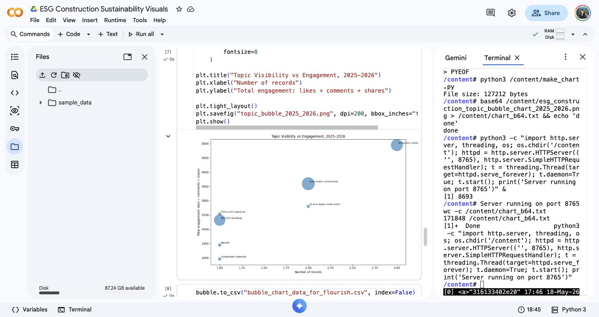

# ESG Construction Sustainability Media Analysis

This project analyses public online conversations about ESG and sustainability in construction.

The aim is to identify which topics are most visible and engaging across media platforms such as YouTube, Reddit, X/Twitter and manually collected public LinkedIn posts.

The project focuses on themes including:

- Embodied carbon
- Low-carbon construction
- Retrofit
- Net zero buildings
- Sustainable materials
- Policy and regulation
- AI and digital construction

## Current status

This is a pilot version using a sample dataset. The pipeline is designed to scale into a larger dataset using public APIs and compliant manual LinkedIn data collection.

## Key question

Which ESG construction topics are both frequent and engaging?

## Method

The project uses Python to:

1. Collect or import public media data
2. Clean and standardise text fields
3. Classify posts into ESG construction topic categories
4. Calculate engagement metrics
5. Create visual datasets for Flourish, RAWGraphs and Power BI

## Example visual

## Tools used

- Python
- pandas
- Google Colab
- Flourish
- RAWGraphs
- GitHub
- CSV data processing

## Notes on data collection

LinkedIn is handled through manual public post collection or official API access only. The project does not use browser automation, login scraping, CAPTCHA bypassing or private data collection.

## Next steps

- Expand the dataset from 20 sample rows to 1,000+ public records
- Add YouTube API collection
- Add Reddit API collection
- Add X/Twitter API collection
- Add manually collected public LinkedIn posts
- Build a Power BI dashboard
- Publish a full case study on gaisina.co.uk
